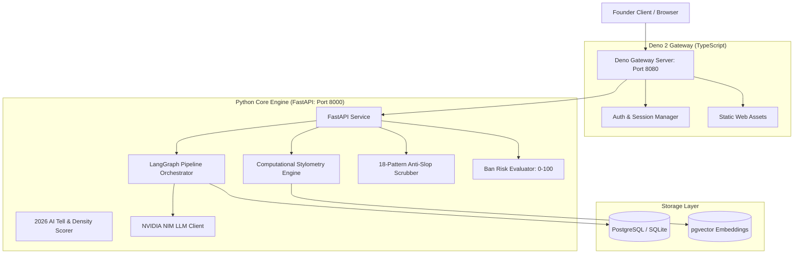
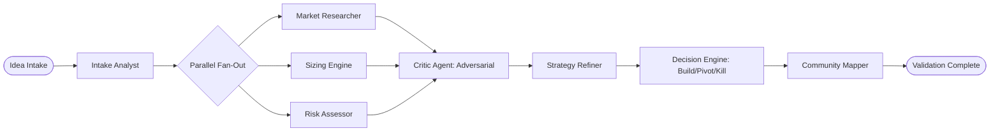

# Deno — System Architecture

## 1. Architectural Philosophy

Deno is built on the principle: **"Deno owns models, rules, and data — not prompts."**

The platform operates as a hybrid system:
- **Core ML & Agent Service (Python):** Orchestration with LangGraph, mathematical stylometry (NumPy/SciPy), pattern-matching anti-slop rules engine, and NVIDIA NIM integration.
- **API Gateway & App Server (Deno 2 + TypeScript):** High-performance Edge/API gateway, request validation, static asset serving, and WebSocket/SSE proxying.
- **Database & Vector Store (PostgreSQL with `pgvector` & SQLite local fallback):** Durable state machine checkpoints, community knowledge graph, founder story bank, and stylometric vector embeddings.

---

## 2. Validation Multi-Agent DAG (LangGraph)

The validation pipeline consists of 8 specialized agents running in a bounded directed acyclic graph:

1. **Intake Analyst:** Normalizes input idea or URL into core hypotheses, target ICP, category, and assumptions.
2. **Market Researcher:** Identifies competitors and existing alternatives; grounds claims with live sources.
3. **Sizing Engine:** Computes TAM / SAM / SOM bottom-up with visible formula and arithmetic.
4. **Risk Assessor:** Evaluates regulatory, technical, moats, and platform dependency risks.
5. **Critic Agent (Adversarial):** Operates independently at high temperature; actively attempts to invalidate the startup thesis and find fatal flaws.
6. **Strategy Refiner:** Rebuilds a strengthened proposition directly answering the Critic's objections.
7. **Decision Engine:** Synthesizes inputs into a definitive `BUILD`, `PIVOT`, or `KILL` verdict with a calibrated confidence score (0-100%).
8. **Community Mapper:** Queries the Knowledge Graph to match the product ICP to 5–10 specific subreddits and social channels with live rule constraints.

---

## 3. Data Model Schema

### Project Entity
- `id` (UUID): Primary key.
- `title` (String): Normalized startup concept title.
- `raw_input` (Text): Original idea text or URL.
- `status` (Enum): `DRAFT`, `VALIDATING`, `VALIDATED`, `VOICE_READY`, `CONTENT_READY`, `PUBLISHING`, `FAILED`.
- `created_at` (Timestamp)

### Validation Report Entity
- `project_id` (UUID): Foreign key.
- `verdict` (Enum): `BUILD`, `PIVOT`, `KILL`.
- `confidence_score` (Float 0.0 - 1.0).
- `top_reasons` (JSON Array): Top 3 arguments supporting the verdict.
- `tam_sam_som` (JSON Object): Numerical sizing breakdown with calculations.
- `competitors` (JSON Array): Competitors with names, positioning, and source URLs.
- `sources` (JSON Array): Clickable Source Ledger records with retrieval timestamps.
- `target_communities` (JSON Array): Mapped communities with karma/rule constraints.

### Founder Story Bank & Voice Profile Entity
- `project_id` (UUID): Foreign key.
- `stylometric_fingerprint` (JSON / Vector): Burrows' Delta vector, sentence-length variance, punctuation distribution.
- `story_bank_entries` (JSON Array): Concrete receipts, metrics, scars, milestones, and personal turning points.

### Content Asset Entity
- `id` (UUID): Primary key.
- `project_id` (UUID): Foreign key.
- `platform` (Enum): `REDDIT`, `LINKEDIN`, `TWITTER`.
- `archetype` (Enum): `TEARDOWN`, `BUILD_IN_PUBLIC`, `POST_MORTEM`, `RESOURCE_DUMP`, `QUESTION`.
- `content` (Text): Post copy.
- `ban_risk_score` (Integer 0-100).
- `risk_deductions` (JSON Array): Itemized deductions with pattern names, quotes, and suggested fixes.
- `voice_distance` (Float): Stylometric distance from founder fingerprint.
- `status` (Enum): `GENERATED`, `SCORED`, `NEEDS_REVISION`, `APPROVED`, `PUBLISHED`, `BLOCKED`.
