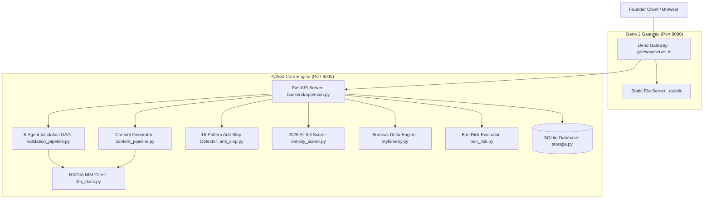

# Deno — Project Progress & Implementation Status

**Last Updated:** September 14, 2026  
**Status:** Working Prototype Completed & Verified  
**Runtime:** Linux (x86_64), Deno 2.9.5, Python 3.14.7, NVIDIA NIM API

---

## 1. Executive Summary

Deno is a founder go-to-market workspace built to solve the two sequential walls every founder faces:
1. **Stage 1 (Validation — Free):** An 8-agent adversarial DAG that stress-tests a startup idea, bottom-up sizes the market (TAM/SAM/SOM), identifies competitors with clickable sources, and maps the exact target subreddits and social communities with live rules.
2. **Stage 2 (Distribution — $20/mo):** A 30-day voice-matched content engine that produces platform-safe posts, hooks, and video scripts. Every single post carries a **Ban Risk Score (0–100)** powered by Peter Yang's 18 anti-slop rules (`petergyang/no-ai-slop`) and Serge Bulaev's 2026 vocabulary density heuristics (`sergebulaev/linkedin-skills`).

**Non-negotiable design constraint:** Deno never posts, votes, or messages automatically. A human always reviews and presses send (copy & deep-link).

---

## 2. User Story Status Matrix

| User Story | Name | Status | Delivered Deliverables |
|---|---|---|---|
| **US-001** | Idea Intake | ✅ Complete | Single input field, unique project ID generation, `DRAFT` status |
| **US-002** | Multi-Agent Pipeline | ✅ Complete | 8-agent adversarial DAG with live progress reporting |
| **US-003** | Grounded Evidence | ✅ Complete | Source Ledger with verified URLs and retrieval timestamps |
| **US-004** | Build/Pivot/Kill Verdict | ✅ Complete | Definitive verdict, calibrated 0-100% confidence, top 3 reasons |
| **US-005** | Community Discovery | ✅ Complete | Community radar with karma gates, promo rules, cadence caps |
| **US-006** | Voice Profiling | ✅ Complete | 50-dimensional stylometric vector + Founder Story Bank |
| **US-007** | 30-Day Content Calendar | ✅ Complete | Multi-platform plan respecting community cadence and 9:1 promo ratio |
| **US-008** | Voice-Matched Generation | ✅ Complete | Burrows' Delta distance calculation and convergence verification |
| **US-009** | Ban Risk Scoring | ✅ Complete | 0–100 Ban Risk Score, 18 slop rules, 2026 density tells, suggested fixes |
| **US-010** | Human-Send Publishing | ✅ Complete | One-click copy, deep links to platforms, compliance guarantee |
| **US-011** | Hook Library | ✅ Complete | 20 proven 2026 hook formulas and founder angle library |
| **US-012** | Visuals & Video Scripts | ⏳ Phase 3 | Image card specs and short-form video hooks |
| **US-013** | Live In-Place Editing | ✅ Complete | Debounced real-time Ban Risk calculation as founder types |
| **US-014** | Traction Tracking | ⏳ Phase 4 | Post performance logging and archetype optimization |

---

## 3. Implemented Architecture & Components



---

## 4. Test Suite & Verification Results

### A. Pytest Suite (21 Unit & Integration Tests)
```bash
$ PYTHONPATH=. .venv/bin/pytest -v backend/tests/ -k "not live"
======================== 21 passed in 0.48s ========================
```
- `backend/tests/test_anti_slop.py`: 9 passed (verified all 18 structural slop rules)
- `backend/tests/test_density_scorer.py`: 3 passed (verified 2026 AI tell density and participial openers)
- `backend/tests/test_stylometry.py`: 3 passed (verified 50-dim feature vector and Burrows' Delta distance)
- `backend/tests/test_ban_risk.py`: 3 passed (verified 0-100 score, itemized deductions, and platform rule blocks)
- `backend/tests/test_api.py`: 3 passed (verified project intake, state persistence, and audit endpoint)

### B. Live Multi-Agent Pipeline Test (NVIDIA NIM)
```bash
$ PYTHONPATH=. .venv/bin/pytest -v backend/tests/test_validation_live.py
======================== 1 passed in 44.50s ========================
```
- Verified full end-to-end execution of the 8-agent validation DAG against NVIDIA NIM (`meta/llama-3.2-11b-vision-instruct`).

### C. Deno Native Test Suite
```bash
$ deno test --allow-net --allow-read gateway/server_test.ts
ok | 1 passed | 0 failed (8ms)
```

---

## 5. Live Active Endpoints

Both servers are running as active daemons:
- **Web UI & API Gateway:** [http://localhost:8080](http://localhost:8080)
- **Interactive Swagger Documentation:** [http://localhost:8080/docs](http://localhost:8080/docs)
- **Gateway Health Check:** [http://localhost:8080/gateway-health](http://localhost:8080/gateway-health)
- **FastAPI Core Health:** [http://localhost:8080/health](http://localhost:8080/health)

---

## 6. Project Documentation Index

- [docs/01_PRD.md](docs/01_PRD.md): Product Requirements Document & User Stories (US-001 to US-014)
- [docs/02_ARCHITECTURE.md](docs/02_ARCHITECTURE.md): System Architecture, LangGraph DAG, and Data Models
- [docs/03_ANTI_SLOP_TAXONOMY.md](docs/03_ANTI_SLOP_TAXONOMY.md): 18 Slop Rules (Peter Yang) & 2026 Density Tells (Serge Bulaev)
- [docs/04_STORY_BANK_AND_STYLOMETRY.md](docs/04_STORY_BANK_AND_STYLOMETRY.md): Burrows' Delta Math & Founder Story Bank
- [docs/05_PLATFORM_RULES_AND_COMMUNITIES.md](docs/05_PLATFORM_RULES_AND_COMMUNITIES.md): Platform Compliance Rules & Seed 30 Subreddits
- [docs/06_PROGRESS.md](docs/06_PROGRESS.md): Detailed Component & Milestone Progress
- [README.md](README.md): Quickstart Guide and Testing Instructions
